# 개발 워크스테이션 구축 프로젝트

이 프로젝트는 터미널, Docker, Git을 활용하여 재현 가능한 개발 환경을 구축하는 과정을 기록합니다.

  

## 1. 실행 환경

- **OS**: Darwin c5r8s4.codyssey.kr 24.6.0 Darwin Kernel Version 24.6.0: Mon Jan 19 22:00:10 PST 2026; root:xnu-11417.140.69.708.3~1/RELEASE_X86_64 x86_64

- **Shell**: /bin/zsh

- **Docker**: Docker version 28.5.2, build ecc6942

- **Git**: git version 2.53.0


```bash
    # OS  확인 / macOS 의 엔진이름이 다윈이며  
    # cf) 커널은 하드웨어와 소프트웨어 사이를 이어 연결해주는 관리자 역할을 수행한다. (역할 : 자원관리,CPU 스케줄링, 하드웨어 제어)
    $ uname -a 
    $ echo $SHELL
    $ docker --version
    $ git --version

```

**출력결과**:
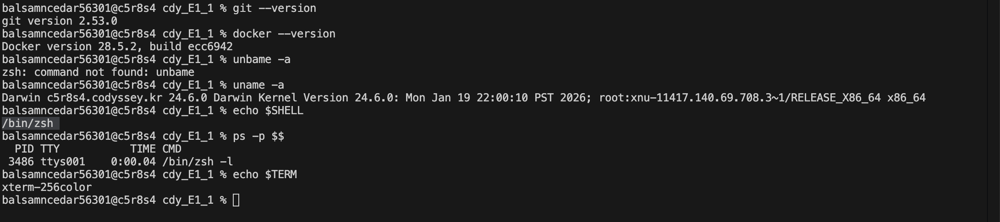

## 2. 프로젝트 구조

  

```text

mission1/

├── README.md  # 본 문서

├── .gitignore # Git 제외 목록

├── images/  # 결과 증빙 스크린샷 (.png, .jpg)

├── practice/  # 터미널 실습용 디렉토리 및 도커파일

└── site/  # 결과물 저장소

```

  

  

## 4. 수행 항목 체크리스트

- [x] 터미널 기본 명령어 숙달 (`ls`, `cd`, `mkdir`, `rm` 등)

- [x] 권한 실습 (chmod) 및 파일 보안 확인

- [x] Docker 설치 및 데몬 동작 확인

- [x] Docker 기본 명령 (images, ps, logs, stats)

- [x] Ubuntu 컨테이너 진입 및 attach/exec 차이 이해

- [x] Dockerfile 작성 및 이미지 빌드

- [x] 포트 포워딩 및 브라우저 접속 확인

- [x] Docker 볼륨을 이용한 데이터 영속성 검증

- [x] Git 로컬 저장소 생성 및 GitHub 원격 연결

  

## 5. 검증 방법 및 결과 요약
| 항목 | 검증 방법 | 결과 위치 |
| :--- | :--- | :--- |
| 터미널 실습 | 명령어 수행 및 파일 이동 확인 | [5.1 터미널 로그](#51-터미널-조작-로그) |
| 권한 실습 | `chmod 000` 후 접근 거부 확인 | [5.2 권한 실습](#52-권한-실습) |
| Docker 기본 | `version`, `info` 확인 | [6.1 Docker 점검](#61-docker-설치-및-기본-점검) |
| 컨테이너 실습 | `hello-world`, `ubuntu` 실행 | [6.2 컨테이너 실습](#62-컨테이너-실행-실습) |
| 커스텀 이미지 | Dockerfile 빌드 및 접속 | [7. 커스텀 이미지 제작](#7-커스텀-이미지-제작) |
| 볼륨 영속성 | 컨테이너 삭제 후 데이터 확인 | [8. Docker 볼륨 및 데이터 영속성](#8-Docker-볼륨-및-데이터-영속성)  |
| Git 설정 | `git config --list` 확인 | [9. Git 및 GitHub 연동 ](#9-Git-및-GitHub-연동) |


-------

## 5. 터미널 및 권한 실습 상세

### 5.1 터미널 조작 로그
#### 1. 현재 위치
```bash
$ pwd
```

* 출력결과
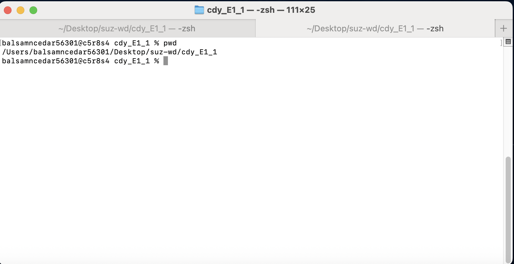
  

#### 2. 파일 목록 

```bash
# -a : 숨김파일
# -l : 관련 정보를 구체적으로 표현
$ ls -al
```

| 항목                            | 설명                  |
| ----------------------------- | ------------------- |
| **권한 (Permissions)**          | `drwxr-xr-x`        |
| **링크 수 (Links)**              | `3`                 |
| **소유자 (Owner)**               | `balsamncedar56301` |
| **그룹 (Group)**                | `balsamncedar56301` |
| **용량 (Size)**                 | `96` Bytes          |
| **마지막 수정 시간 (Last Modified)** | `Jul 29 11:55`      |
| **파일/디렉토리 이름 (Name)**         | `docker-test`       |

### 권한(`drwxr-xr-x`) 분석

| 기호  | 의미           | 설명                      |
| --- | ------------ | ----------------------- |
| `d` | Directory    | 디렉토리                    |
| `-` | Regular File | 일반 파일 (`d` 대신 `-`가 표시됨) |
| `r` | Read (4)     | 읽기 권한                   |
| `w` | Write (2)    | 쓰기 권한                   |
| `x` | Execute (1)  | 실행(접근) 권한               |

### 권한 구성

| 구분         | 권한    | 숫자 표현       | 의미            |
| ---------- | ----- | ----------- | ------------- |
| 소유자(Owner) | `rwx` | `7` (4+2+1) | 읽기, 쓰기, 실행 가능 |
| 그룹(Group)  | `r-x` | `5` (4+1)   | 읽기, 실행 가능     |
| 기타(Other)  | `r-x` | `5` (4+1)   | 읽기, 실행 가능     |

### 기타 항목 설명

| 항목                | 설명                                                                         |
| ----------------- | -------------------------------------------------------------------------- |
| **링크 수 (3)**      | 해당 파일/디렉토리와 연결된 하드 링크의 개수. 디렉토리는 일반적으로 `2` 이상이며, 하위 디렉토리가 생길 때마다 증가할 수 있다. |
| **소유자 (Owner)**   | 파일 또는 디렉토리의 소유 계정                                                          |
| **그룹 (Group)**    | 파일이 속한 그룹                                                                  |
| **용량 (96 Bytes)** | 파일 또는 디렉토리가 사용하는 크기(바이트 단위)                                                |
| **수정 시간**         | 마지막으로 내용이 수정된 시각                                                           |
| **이름**            | 파일 또는 디렉토리의 이름                                                             |


* 출력결과 
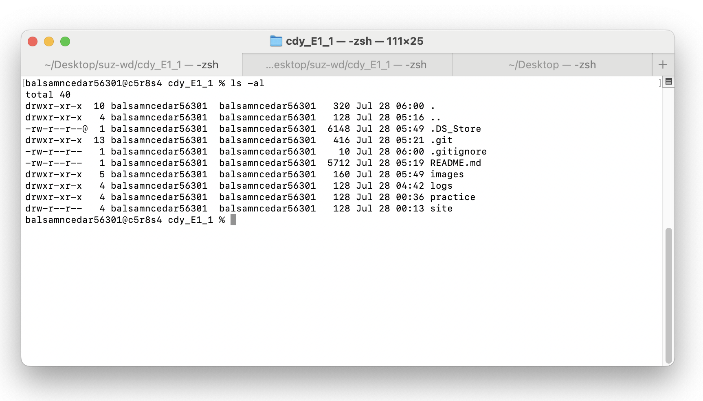
  

####  3. 파일 생성 및 복사,  결과 확인 

```bash
$ touch memo.txt
$ echo "Hello Terminal" >> memo.txt
$ cp practice/memo.txt practice/memo_backup.txt
$ cat memo_backup.txt
```
  
* 출력결과
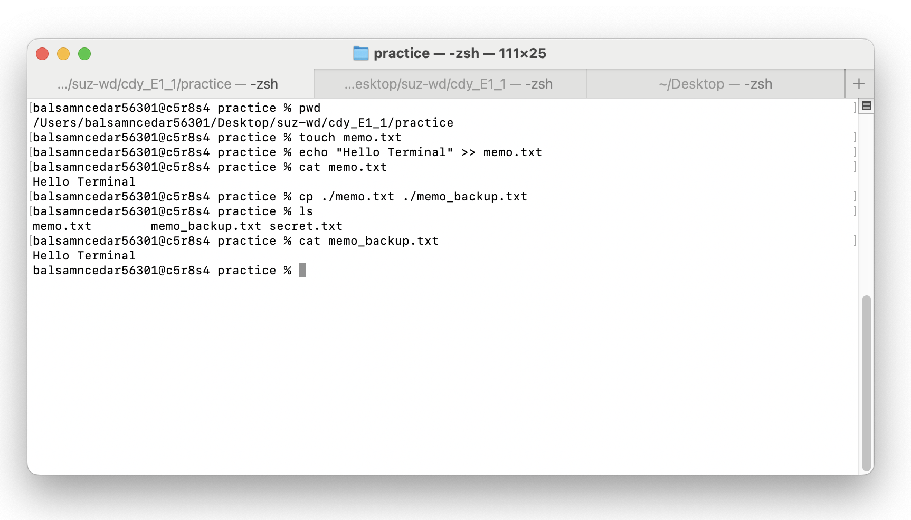


####  4. 파일 이동 및 이름 변경 

```bash
$ ls 
$ mv memo_backup.txt ../site/moved_memo.txt
$ cd ../site/
$ ls -al
```
  
  
* 출력결과
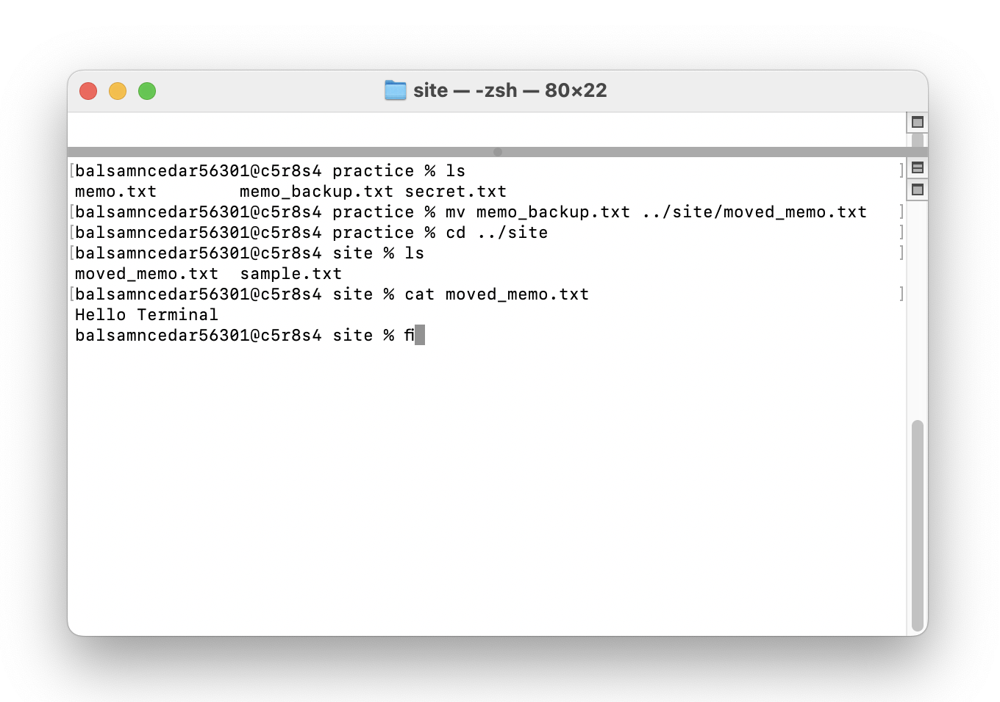  

  

#### 5. 파일 삭제
```bash
$ rm  site/moved_memo.txt
$ ls -al
```
  
* 출력결과
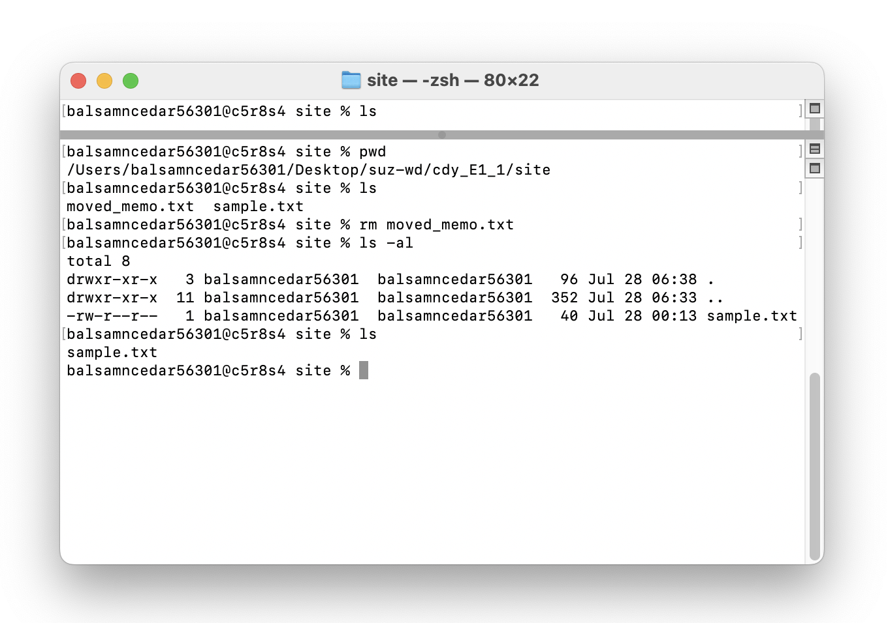


####  6. 빈파일 생성및 파일 내용확인 

```bash
$ touch sample.txt
$ ls 
$ echo "This is sample text"  >> sample.txt
$ cat sample.txt
```
  
* 출력결과
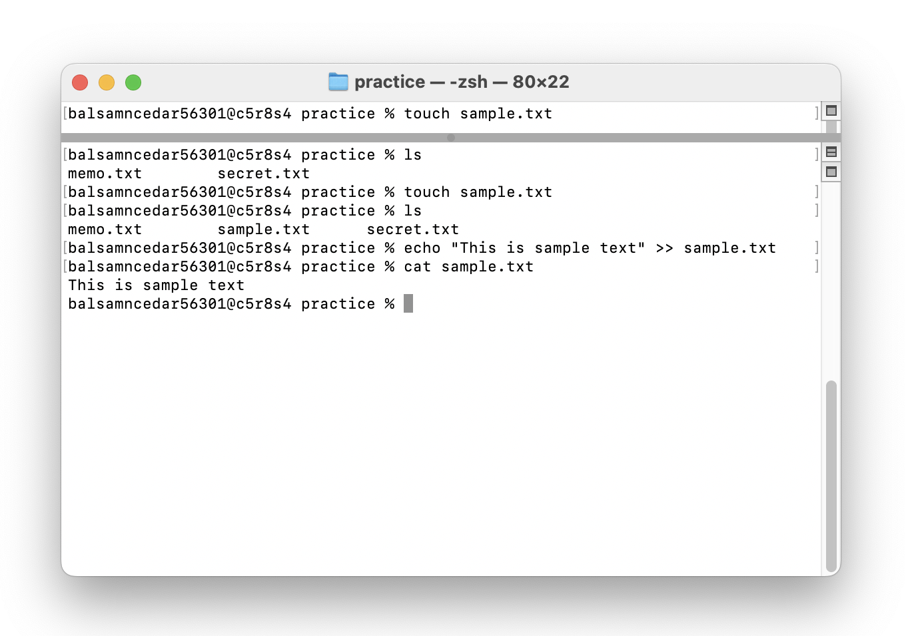
  

### 5.2 권한 실습

- (참고) 권한 실습을 위해 평문으로 작성하였으나 실제 운영환경에서는 보안처리 후 작성.
```bash
$ touch  secret.txt
$ echo "my-password-1234" >> secret.txt
$ ls -al
$ chmod 000 secret.txt
$ cat secret.txt
$ chmod 777 secret.txt
$ cat secret.txt

```

* 출력결과
- chmod 000 적용 시 소유자라도 권한이 없으면 Permission denied 발생 확인 
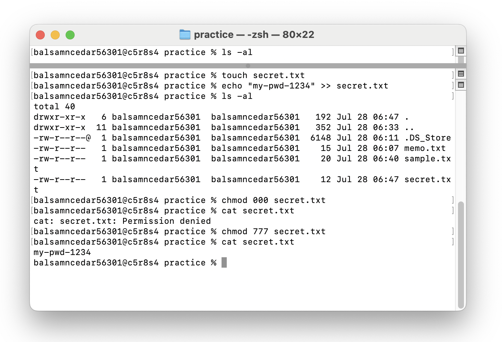


---

## 6. Docker 운영 실습

### 6.1 Docker 설치 및 기본 점검
- **버전 확인**: `docker --version`
- **데몬 상태**: `docker info` (또는 OrbStack 대시보드 확인)
- **이미지 다운 목록 확인** : `docker images` 
   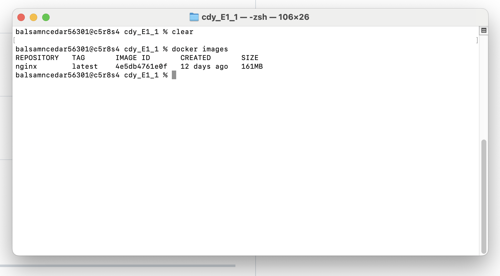
- **로그 확인**:  `docker logs`
    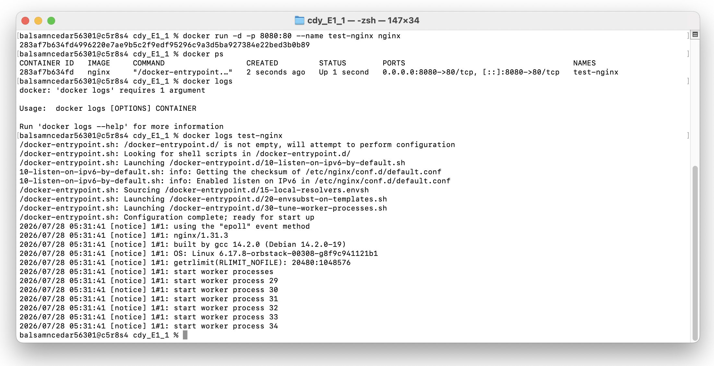
    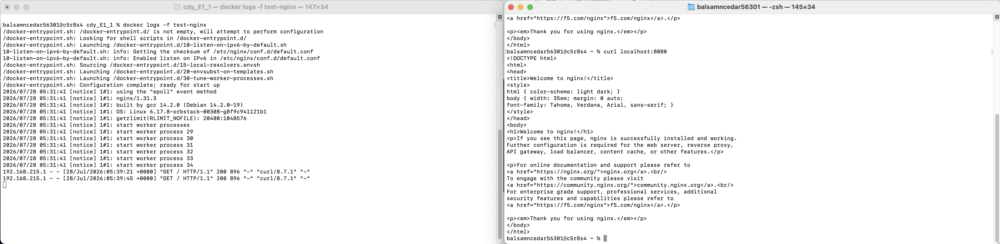

- **리소스 확인** : `docker stats`
    ```bash
    docker stats test-nginx
    ```
    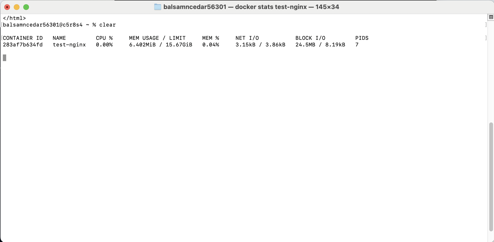

### 6.2 컨테이너 실행 실습
1. **hello-world**: `docker run hello-world` 성공 기록
2. **Ubuntu 진입**:
   ```bash
   docker run -it --name my-ubuntu ubuntu bash
   # 내부에서 ls, echo 수행
   ```
3. **관찰 결과 (attach vs exec)**:
   - `attach`: 메인 프로세스에 연결되어 `exit` 시 컨테이너 종료됨.
   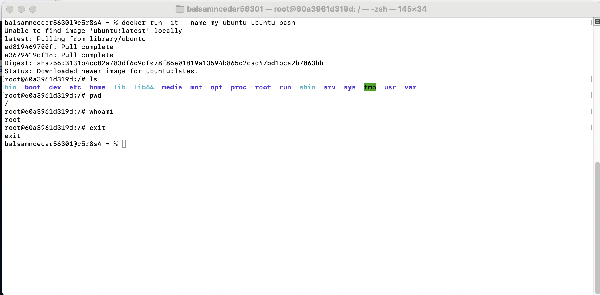
   
   - `exec`: 새로운 세션을 열어 `exit` 해도 컨테이너가 유지됨.
    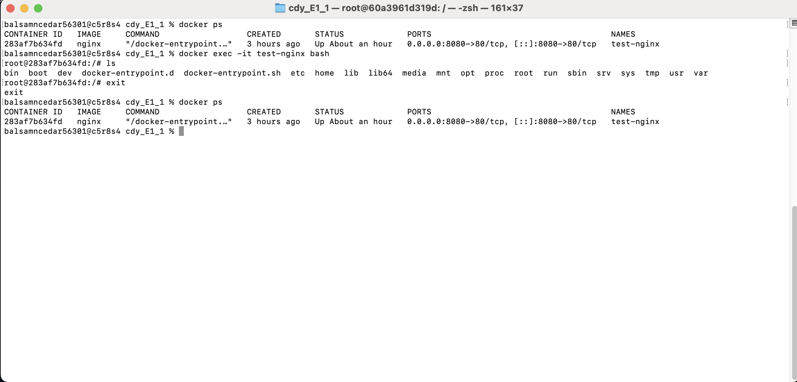
---

## 7. 커스텀 이미지 제작
    - 작업 순서 : docker 파일 작성 -> 빌드 -> 띄운 위치로 웹에서 확인 
    - 비교 방향 : 커스텀 이미지와 기본 이미지 비교


```bash
# 1. 베이스 이미지 선택 - 경량 모델 이미지 
FROM nginx:alpine


# 2. 작업 디렉토리 설정 
# 이후의 COPY나 RUN은 모두 이 폴더 기준으로 동작  
WORKDIR /usr/share/nginx/html

# 3. 환경 변수 및 라벨
ENV APP_OWNER="BalsamNCedar"
ENV APP_STATUS="Learning"

LABEL maintainer="balsamncedar56301@c5r8s4"
LABEL description="기본 Nginx 페이지를 커스텀 페이지로 교체"

# 4. 패키지 설치 및 캐시 삭제를 통한 이미지 용량 최적화
RUN apk update && apk add --no-cache curl

# 5. 정적 컨텐츠 교체  
# WORKDIR을 설정했으므로, 목적지 경로를 짧게 사용가능
COPY index.html ./index.html


# 6. C : 헬스체크 추가 - 컨테이너 상태 감시
# cur -f (fail)
HEALTHCHECK --interval=30s --timeout=3s \ 
    CMD curl -f http://localhost/ || exit 1

# (참고) NginX는 기본적으로 80 포트사용
EXPOSE 80
```


```bash
# 만든 도커이미지 빌드
docker build -t my_custom_nginix:v1 .
```

- 컨테이너에  (커스텀이미지 - 8888에 매핑 ) vs  (기본 이미지 - 8080 에 매핑)
```bash
docker run -d -p 8888:80 --name custom_web my-custom-nginx:v1

docker run -d -p 8080:80 --name original-web nginx:alpine
```


* 출력결과
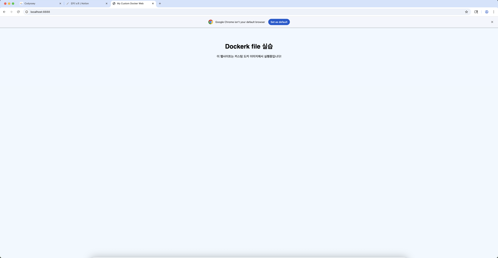
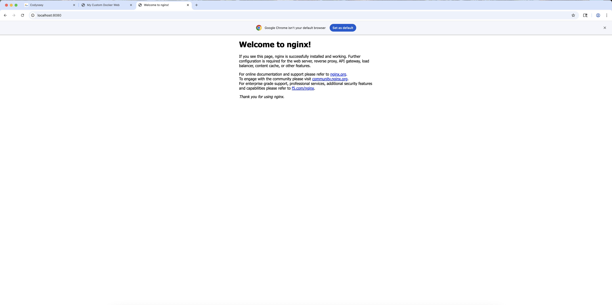

    - 이미지의 메타 데이터를 확인하고 싶을때
    ```bash
    docker inspect my-custom-nginx:v1 

    docker inspect my-custom-nginx:v1 --format='{{json .Config.Env}}' | python3 -m json.tool 
    inspect my-custom-nginx:v1 --format='{{json .Config.Labels}}' | python3 -m json.tool

    ```

* 출력 결과
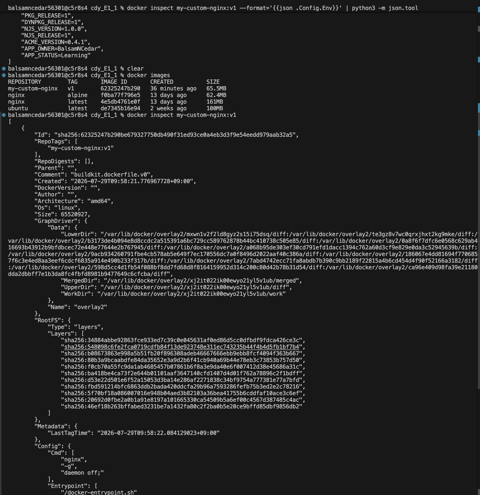
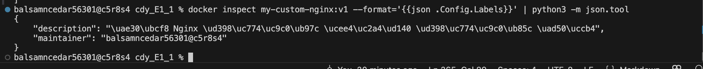

    - curl 로 확인하기 
    ```bash
    # docker 주소
    # 출력 결과 html 
    curl localhost:8080

    # 돌아가고 있는지 HTTP 응답값 줌 
    curl -I localhost:8080 
    
    ```
* 출력 결과
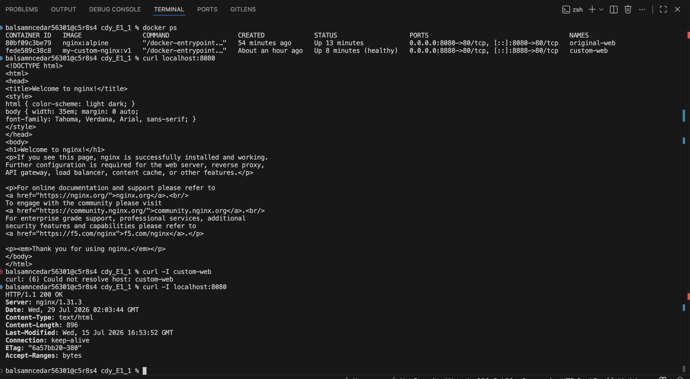    

## 8. Docker 볼륨 및 데이터 영속성 
- 바인드 마운트: "내 컴퓨터의 특정 폴더를 직접 연결 (내가 관리)"
- 볼륨: "도커가 관리하는 전용 저장소를 연결 (도커가 관리)"

- 바인드 마운트 (호스트의 파일을 컨테이너에 연결하여 사용할수 있도록 하는데 사용한다)
- 비교 방식 : 바인드 마운트를 실행한 컨테이너와 아닌 컨테이너 비교
- 호스트의 CDY_E1_1/practice/docer-test 안의 파일 host_data.txt 안의 내용 Hello from Host이 컨테이너 안에 있는지 확인

### 8.1. 바인드 마운트 된 컨테이너


```bash
mkdir docker-test
echo "Hello from Host" > host_data.txt
cat docker-test
rm host_data.txt
clear
ls
cd docker-test
ls
echo "Hello from Host" > host_data.txt
cat ./host_data.txt
docker run -it --name bind-test -v $(pwd):data alpine sh
docker run -it --name bind-test -v $(pwd):/data alpine sh
ls
pwd
cat host_data.txt
```


- **출력결과** 
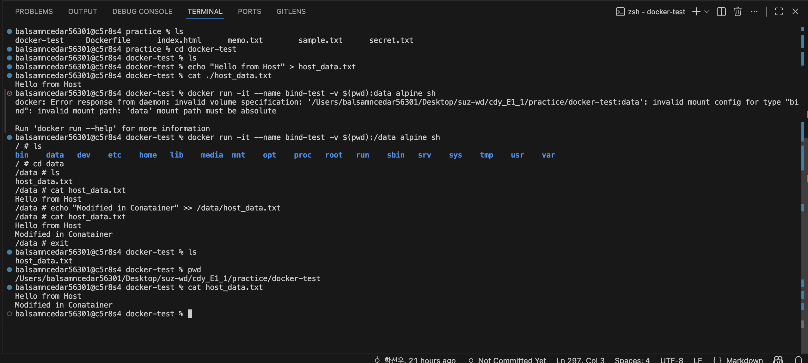

- 추가 권장사항 
- 바인드 마운트 명령어 작성시 실행시점에 경로가 헷갈리지 않도록 명시적인 환경변수 사용을 권장

    ```bash
    # 변경전 
    $ docker run -it --name bind-test -v $(pwd):/data alpine sh

    # 변경후 (모든 터미널 세션에서 공통으로 자주사용한다면 .zshrc에 넣기)
    $ HOST_PATH=$(pwd)
    $ docker run -it --name bind-test -v "$HOST_PATH:/data" alpine sh

    ```

### 8.2. 기본 컨테이너 


```bash
docker run -it --name no-v-test alpine sh  
/ # cd /data

```
- **출력결과** 
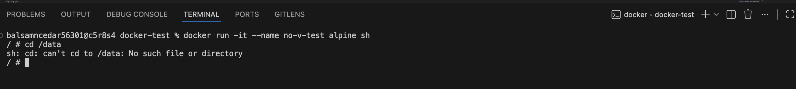


### 8.3 볼륨
- 볼륨 생성
    ```bash
    # 볼륨생성
    # docker volume create [생성할 볼륨 이름]
    # 확인 : docker volume ls

    docker volume create my-test-vol
    docker volume ls
    ```
- **출력결과** 
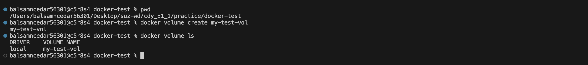   

- 컨테이너에 볼륨 연결
- 생성된 볼륨을 연결한 컨테이너 실행 후 테스트 메모 작성 
- **출력결과** 
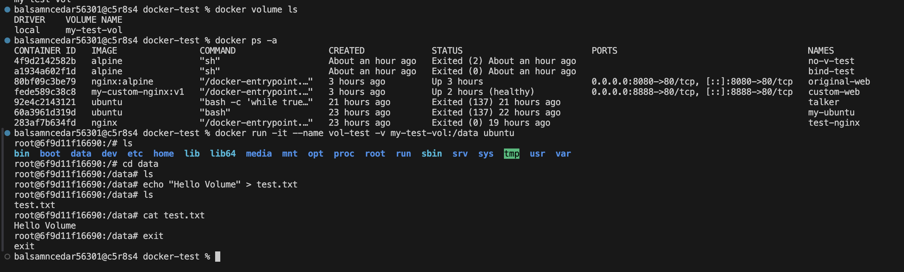

- 영속성 테스트 
- **출력결과** (사전 준비 - 아까 띄운 컨테이너 삭제)
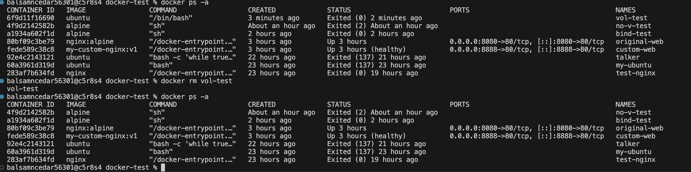
- 같은 볼륨을 다른 컨테이너에 연결시켜서 띄웠을때 
- **출력결과** 
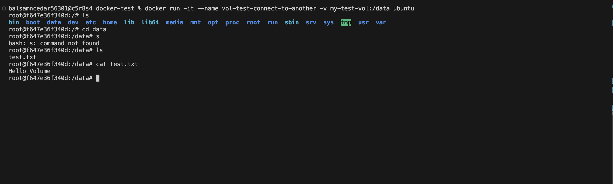

## 9. Git 및 GitHub 연동 
### 9.1. git global 등록


```bash
# 현재 등록된 내용확인
git config --global --list

# 등록
git config --global user.name "balsamncedar" 
git config --global user.email "balsamncedar5@gmail.com"
git global --list
```


- **출력결과** 
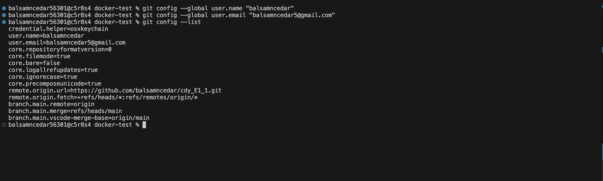

### 9.2. SSH 키 생성
- 방법 :  키생성 -> 키 읽어서 복사 -> 깃헙에 등록 (authentic Key) -> 터미널에서 확인 

    ```bash
    # ssh-keygen : ssh-key 생성 / -t 암호 보안 타입 (ed25519 권장 안정성/간결/속도) / -C 코멘트 
    # ssh-keygen -t   
    ssh-keygen -t ed25519 -C "balsamncedar5@gmaiil.com"

    # 깃헙 등록후 터미널 확인
    ssh -T git@github.com
    ```

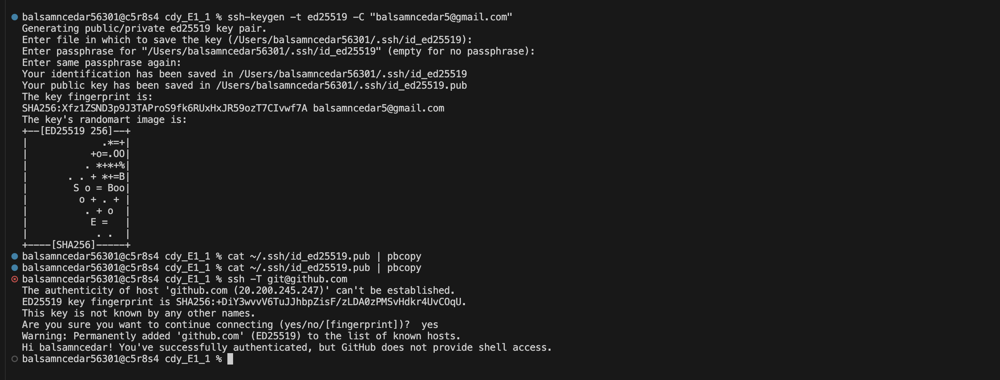

## 10. 트러블슈팅 (Troubleshooting)
### Case 1: 스크린샷 관리 자동화
- **문제**:  `README.md` 작성과정에서 스크린샷 첨부를 해야하는데 매번 스크린샷 저장후 이름 바꾸어 수동 이동시키는 것에 불편을 느낌
- **원인**: 특정 경로의 최신 스크린샷 파일을 현재 프로젝트의 `/images` 폴더로 옮기고 이름을 변경해주는 간단한 쉘 스크립트(또는 Alias)를 AI와 함께 `mvcap`을 작성하여 활용함.
- **해결**: 문서화 작업 시간을 단축하고 파일 관리의 일관성을 유지함.

```bash
vi ~/.zshrc
#  내용 수정
source ~/.zshrc

cat ~/.zshrc
```

- **스크립트 내용** 
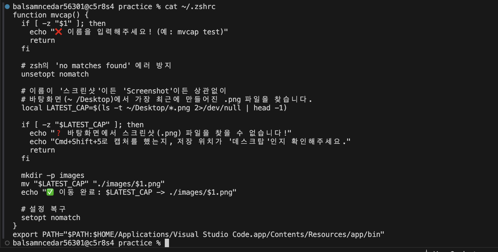


### Case 2: 마크다운 내부 링크 작동 불가
- **문제**: README 목차와 요약 표에서 내부 링크(`[텍스트](#앵커)`)를 클릭했을 때 해당 섹션으로 이동하지 않거나 에디터에서 문법 오류(색상 이상)가 발생함.
- **원인**: GitHub 마크다운의 앵커 규칙(공백은 하이픈`-`으로 대체, 대문자는 소문자로 변환)을 준수하지 않았고, 링크 주소 내에 공백이 포함되어 있었음.
- **해결**: 링크 주소 내의 하이픈으로 대체하여 해결함.


---